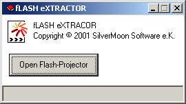



## fLASH eXTRACTOR

### Description

extracts .swf-files from compiled Flash-Projectors...
 
### More Info
 
Projector-Executable

.swf-file

             |
---                |---
**Submitted On**   |2002-04-17 02:11:12
**By**             |[Benedikt Huebschen](https://github.com/Planet-Source-Code/PSCIndex/blob/master/ByAuthor/benedikt-huebschen.md)
**Level**          |Advanced
**User Rating**    |4.7 (14 globes from 3 users)
**Compatibility**  |VB 4\.0 \(32\-bit\), VB 5\.0, VB 6\.0
**Category**       |[Internet/ HTML](https://github.com/Planet-Source-Code/PSCIndex/blob/master/ByCategory/internet-html__1-34.md)
**World**          |[Visual Basic](https://github.com/Planet-Source-Code/PSCIndex/blob/master/ByWorld/visual-basic.md)
**Archive File**   |[fLASH\_eXTR727324162002\.zip](https://github.com/Planet-Source-Code/benedikt-huebschen-flash-extractor__1-33873/archive/master.zip)

### API Declarations

(none)

